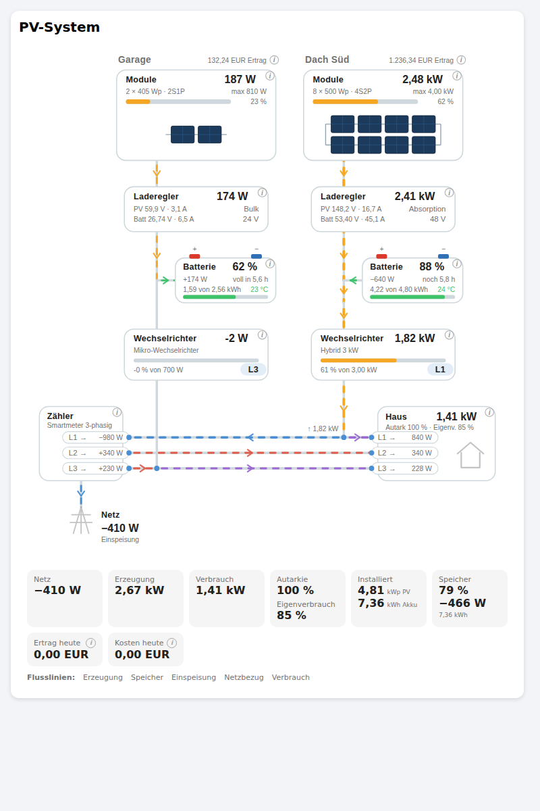
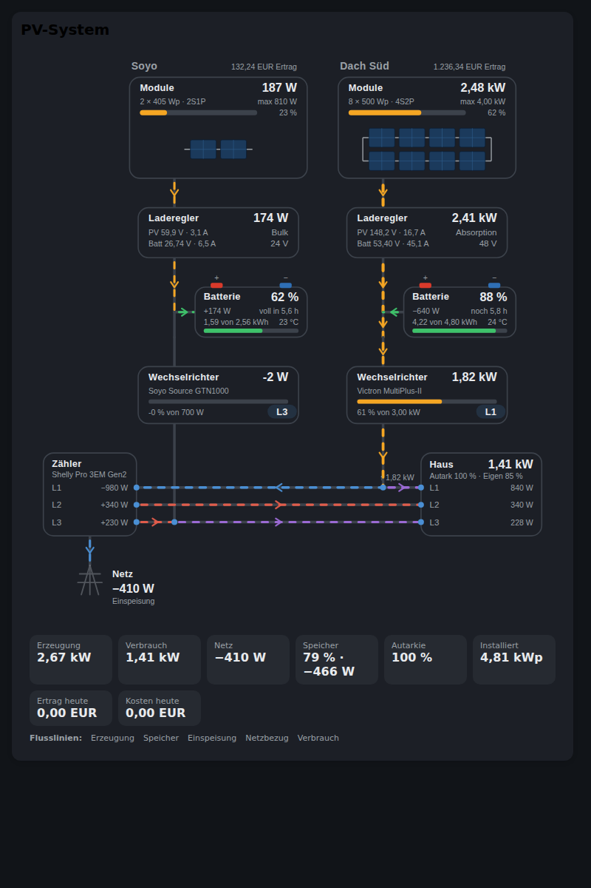

# PV-System für Home Assistant

[![hacs][hacs-schild]][hacs]
[![Lizenz][lizenz-schild]](LICENSE)

Eine Integration mit eigener Lovelace-Karte, die eine Photovoltaikanlage als
**Flussdiagramm** zeigt: Module, Laderegler, Batterie, Wechselrichter, Phase,
Netz und Haus – für beliebig viele Anlagen an einem Standort.

Die Integration misst nichts selbst. Sie nimmt die Sensoren, die ohnehin im
System stehen – Shelly, Victron, Fronius, ein BMS über MQTT –, bringt sie auf
gemeinsame Einheiten und setzt daraus ein Bild zusammen.



<details>
<summary>Dunkles Design</summary>



</details>

> **Beta.** Version 0.0.1 ist der erste Entwurf. Aufbau der Konfiguration und
> Namen der Sensoren können sich noch ändern.

## Was sie kann

* **Mehrere Anlagen** an einem Standort, jede mit eigenen Modulen, eigenem
  Laderegler, eigener Batterie und eigenem Wechselrichter.
* **Verschaltung sichtbar**: Module werden gezeichnet, wie sie verschaltet
  sind – vier in Reihe, zwei Strings parallel (4S2P) sieht man dem Bild an.
* **Aktuelle Leistung und Spitzenleistung** nebeneinander: Was liefert die
  Anlage gerade, und was wäre möglich?
* **Einphasige Wechselrichter im Netzparallelbetrieb**: Jeder Wechselrichter
  liegt auf einer Phase, und die Karte zeichnet ihn auf genau diese Schiene.
  Drei Wechselrichter auf zwei Phasen sind der Normalfall, nicht die Ausnahme.
* **Laderegler** mit Eingangs- und Ausgangsspannung und einstellbarer
  Systemspannung (12/24/48/96 V oder Hochvolt).
* **Batterien** mit Ladestand, Leistung, Spannung, Temperatur, Zyklen,
  Gesundheitszustand und Restlaufzeit bis zur Entladegrenze.
* **Smart Meter** mit Gesamtleistung und Leistung, Spannung und Strom je Phase.
* **Hausverbrauch, Autarkie und Eigenverbrauch** – gemessen, wenn es einen
  Sensor gibt, sonst gerechnet.
* **Einheiten werden umgerechnet**: W, kW, MW, Wh, kWh, mV, mA, °F – die
  Summe stimmt, egal wie die Quelle zählt.
* **Vorzeichen werden festgelegt**, nicht geraten: Du sagst, ob positiv am
  Zähler Bezug oder Einspeisung bedeutet.
* **Ändern direkt in der Karte**: Auf die Module tippen, Anzahl und Leistung
  eintragen, fertig.
* **Eigenes Symbol** statt des Puzzleteils – ab Home Assistant 2026.3 ohne
  Umweg über einen Eintrag in `home-assistant/brands`.

## Installation

### Über HACS (empfohlen)

1. HACS → drei Punkte oben rechts → **Benutzerdefinierte Repositories**
2. `https://github.com/tach2004/ha-pv-system` als **Integration** hinzufügen
3. „PV-System" suchen, herunterladen, Home Assistant neu starten
4. **Einstellungen → Geräte & Dienste → Integration hinzufügen → PV-System**

Die Karte wird von der Integration selbst ausgeliefert und eingetragen. Ein
Eintrag unter *Einstellungen → Dashboards → Ressourcen* ist nicht nötig.

### Von Hand

Den Ordner `custom_components/pv_system` nach `config/custom_components/`
kopieren und Home Assistant neu starten.

Ausführlich in [docs/INSTALLATION.md](docs/INSTALLATION.md).

## Einrichten

Bei der Einrichtung werden nur Name, Anzahl der Anlagen und der Netzzähler
abgefragt. Alles Weitere steht anschließend unter **Konfigurieren**:

```
PV-System
├── Anlagen ──┬── Anlage 1 ──┬── Name
│             │              ├── Module      Anzahl, Wp, Verschaltung, Sensoren
│             │              ├── Laderegler  Systemspannung, Ein-/Ausgang
│             │              ├── Batterie    Kapazität, Ladestand, Temperatur
│             │              └── Wechselr.   Nennleistung, Phase, Sensoren
│             └── Anlage 2 ...
├── Netz und Zähler          Gesamt- und Phasenleistung, Vorzeichen
├── Haus und Verbrauch       gemessen oder gerechnet
└── Darstellung              Animation, Verschaltung, Preise
```

Änderungen sammeln sich im Menü und werden mit **„Speichern und schließen"**
übernommen.

## Die Karte

```yaml
type: custom:pv-system-card
```

Das genügt bei einem Standort – die Karte findet ihn selbst. Weitere Optionen:

| Option    | Vorgabe | Bedeutung                                        |
|-----------|---------|--------------------------------------------------|
| `system`  | –       | `entry_id` oder Titel, wenn mehrere Standorte da sind |
| `compact` | `false` | Kennzahlenleiste unter dem Diagramm weglassen    |
| `titel`   | –       | Eigene Überschrift; `false` lässt sie ganz weg   |

Im Abschnitts-Layout meldet die Karte ihre Größe über `getGridOptions`: volle
Breite als Vorgabe, mindestens sechs Spalten, Höhe nach Inhalt. Über den
Layout-Regler lässt sich beides ändern.

Ein Klick auf einen Block öffnet die Einzelheiten darunter. Werte mit
gepunkteter Unterstreichung führen zur Original-Entität.

Ein vollständiges Beispiel-Dashboard liegt in
[dashboards/pv-system.yaml](dashboards/pv-system.yaml).

## Entitäten

Je Standort entstehen Summensensoren (PV-Leistung, Spitzenleistung,
Ausnutzung, Batterieleistung und -ladestand, Netzleistung, Bezug, Einspeisung,
Hausverbrauch, Autarkie, Eigenverbrauch, Status), je Anlage die Werte dieser
Anlage und je Phase Leistung, Spannung und Erzeugung.

Angelegt wird nur, was auch etwas anzeigen kann: Ohne Batterie entstehen keine
Batteriesensoren, ohne Temperaturfühler kein Temperatursensor.

**Eingeschaltet** ist von sich aus nur, was die Integration ausrechnet.
Reine Spiegel vorhandener Sensoren – Spannungen, Temperaturen, Netzfrequenz,
Zählerstände – sind angelegt, aber abgeschaltet: Sie kosten sonst
Datenbankplatz für Werte, die schon da sind. Ein Klick in der Geräteansicht
schaltet sie ein. Die Karte zeigt sie ohnehin, sie liest die Originale.

## Dienste

| Dienst                    | Wofür                                         |
|---------------------------|-----------------------------------------------|
| `pv_system.set_modules`   | Anzahl, Leistung und Verschaltung der Module  |
| `pv_system.set_battery`   | Kapazität und Nennspannung                    |
| `pv_system.set_charger`   | Systemspannung und Ladestrom                  |
| `pv_system.set_inverter`  | Nennleistung und Phase                        |
| `pv_system.add_plant`     | Weitere Anlage anlegen                        |
| `pv_system.remove_plant`  | Anlage entfernen                              |

```yaml
action: pv_system.set_modules
target:
  entity_id: sensor.zuhause_status
data:
  plant: Dach Süd
  count: 8
  peak_wp: 500
  series: 4
  parallel: 2
```

## Wie gerechnet wird

```
Hausverbrauch   = Wechselrichterleistung + Netzleistung   (positiv = Bezug)
Autarkie        = (Verbrauch − Netzbezug) / Verbrauch
Eigenverbrauch  = (Erzeugung − Einspeisung) / Erzeugung
Speicherinhalt  = Kapazität × Ladestand
```

Bei mehreren Batterien wird der gemeinsame Ladestand **nach Kapazität
gewichtet** – eine 2,56-kWh- und eine 4,8-kWh-Batterie wiegen nicht gleich
schwer. Die Hintergründe stehen in [docs/KONZEPT.md](docs/KONZEPT.md).

## Tests

```bash
python3 tests/test_rechnung.py
python3 tests/test_topologie.py
python3 tests/test_dateien.py
# oder: pytest tests/
```

Die Tests laufen ohne Home-Assistant-Installation: Sie ersetzen die wenigen
Namen, die die Rechenmodule importieren, durch schlanke Nachbauten.

## Veröffentlichen

Für die Aufnahme in HACS fehlen noch Beschreibung und Themen am
GitHub-Repository – die Prüfung meldet das, und
[docs/HACS.md](docs/HACS.md) sagt, wo es einzutragen ist.

## Lizenz

[Apache License 2.0](LICENSE)

[hacs]: https://github.com/hacs/integration
[hacs-schild]: https://img.shields.io/badge/HACS-benutzerdefiniert-41BDF5.svg
[lizenz-schild]: https://img.shields.io/badge/Lizenz-Apache%202.0-blue.svg
